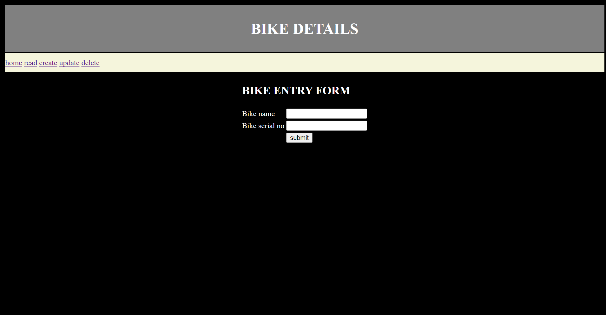

# 🚲 Bike Entry Form (Django)
This is a Django-based Bike Entry Form that allows users to add bike details into a database. It demonstrates form handling and CRUD operations in Django.

## Features 
- ✅ Add bike details (e.g., brand, model, bike no, owner, etc.)
- ✅ Form validation using Django Forms
- ✅ Store data in a SQLite
- ✅ View, update, and delete bike entries
- ✅ User-friendly interface

## 🛠️ Technologies Used 
- Django
- HTML
- CSS
- javascript 
- SQLite (Database) 

## 🚀 Installation & Setup 
1. Clone the Repository
``` bash
    git clone https://github.com/GOKUL988/Bike-details-in-django.git
```

2. Navigate to the project folder: 
``` bash
    cd Bike-details-in-django
```
3. Install Dependencies 
``` bash 
    pip install -r requirements.txt  
```
4. Apply Migrations 
``` bash 
    python manage.py migrate  
```
5. Run the Development 
``` bash 
    python manage.py runserver  
```

## sample Images 

# 

# 

# 

# 

# 

# 

# 
